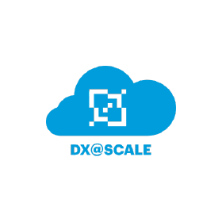
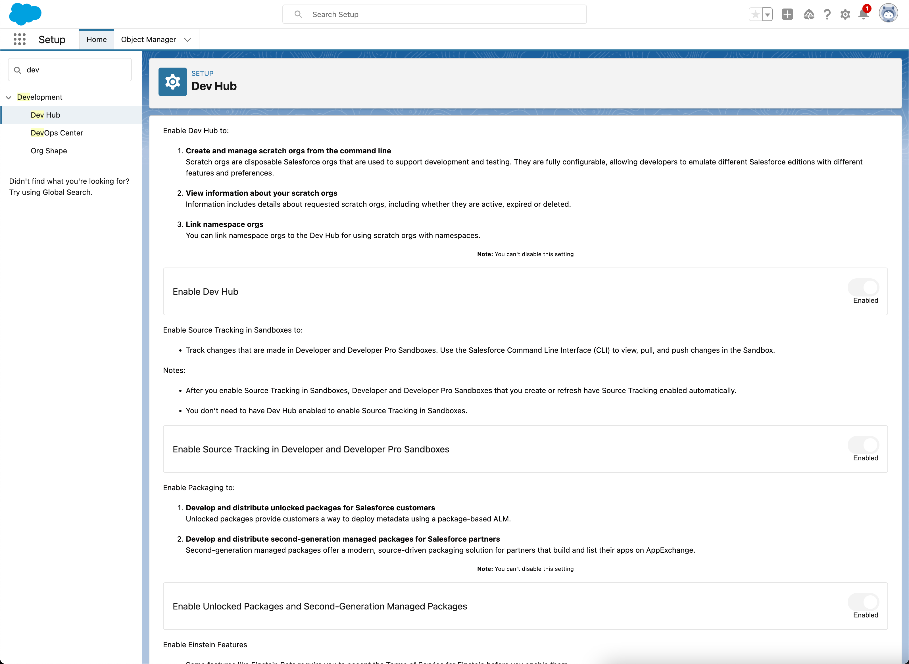

 
#R1.0 Production Playbook
---

Category  | Details
:-------------      | :-------------
Release             | 1.0.0
Release Name        | DXatScale Orchestrator
Sandbox Type        | Production
Date Created        | YYYY.MM.DD
Change Log          | - Initial Document Creation
.                   | - Additional Comments

---
##Table of Contents
- Assumptions
- Prerequisites
- Reference Articles
- Open Items
- Pre Deployment
- Deployment
- Post Deployment

---
##Assumptions
- Person Account is Enabled in Production

---
##Prerequisites 
- _System Administrator Profile_ and login access to Production

##Reference Articles
- [DX@Scale](https://dxatscale.io)
- [DX@Scale GitHub](https://github.com/dxatscale)
- [DX@Scale Documentation](https://docs.dxatscale.io)

##Open Items
- [ ] Item A
- [ ] Item B
- [ ] Item C

##Pre Deployment 

---

``Sample Manual Configuration Step``

- [ ] [1] - ``Enable Dev Hub`` (1 min)
1. Navigate to **Setup > Development > Dev Hub**
2. Toggle ``Enable Dev Hub`` to 'Enable'  
 

##Deployment 

---

1. ``<Insert Step(s)>``

##Post Deployment 

---

1. ``<Insert Step(s)>``